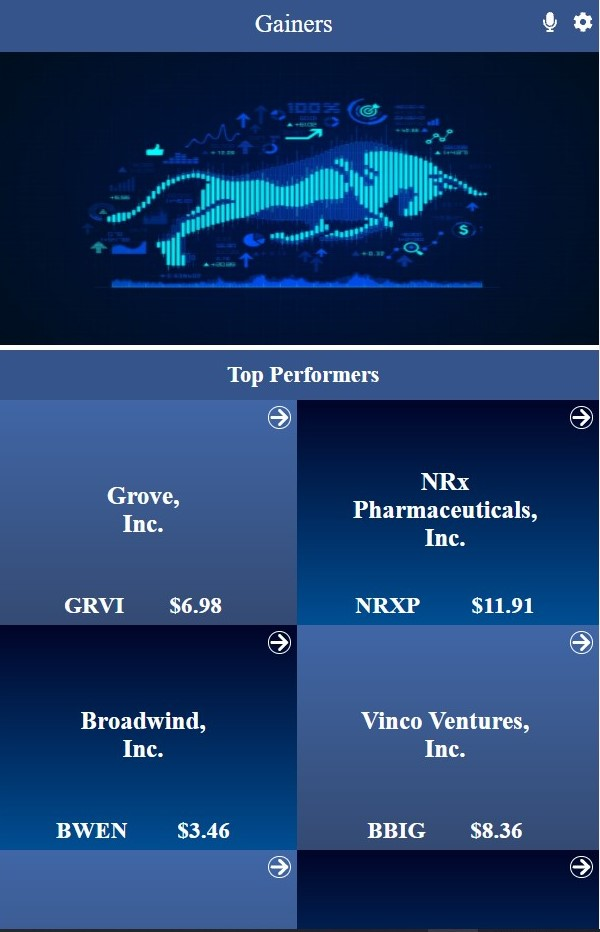
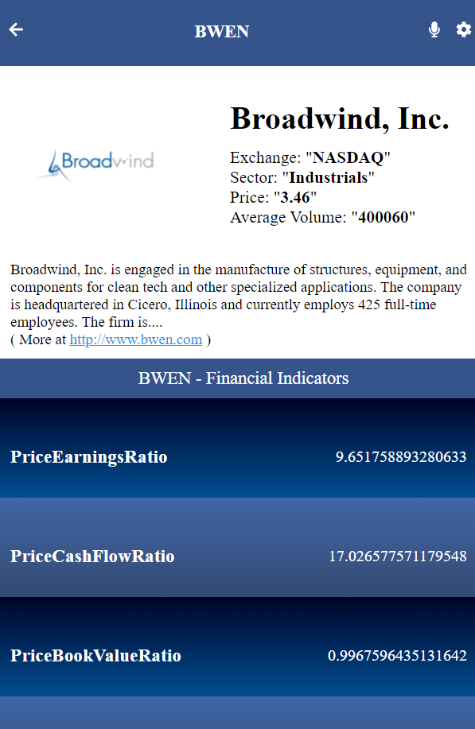

# Best Performing Companies

> A mobile web application to filter top performing companies each day. Data is based on real-time. The application has two pages. Homepage displays a list of companies filtered by gains. The detail page shows details for the company along with financial indicators performance.

### Companies List (Homepage)

### Company Details and Financials (detail page)

## Built With

- ReactJS
- Redux
- Jest and React Testing Library

## Live demo

[Best Performeing Companies Project]()

## Video Presentation
[Check my video presentation](https://www.loom.com/share/8d4bcbc8e6fc46a384419e054cfa5521)

## Getting Started

### To get a local copy, run the following steps:

- `git clone git@github.com:faizi2500/finance-app.git`
- `cd finacne-app` to access the project on the terminal.
- `npm install` from your editor's terminal.
- `npm start` to open live server where you can see your changes
- `npm test` to run the tests for react components and redux reducers

👤 **Faizan Zahid**

- GitHub: [@faizi2500 ](https://github.com/faizi2500)
- Angelist: [@faizan_2500 ](https://angel.co/u/faizan2500)
- LinkedIn: [@faizan2500](www.linkedin.com/in/faizan2500)

## 🤝 Contributing

Contributions, issues, and feature requests are welcome!

Feel free to check the [issues page](https://github.com/julie-ify/covid-19-tracking-project/issues).

## Show your support

Give a ⭐️ if you like this project!

## Acknowledgments

- A very big thank you to [Nelson Sakwa on Behance](https://www.behance.net/sakwadesignstudio) whose design guidelines was used.
- Coding partner, Standup and morning session team